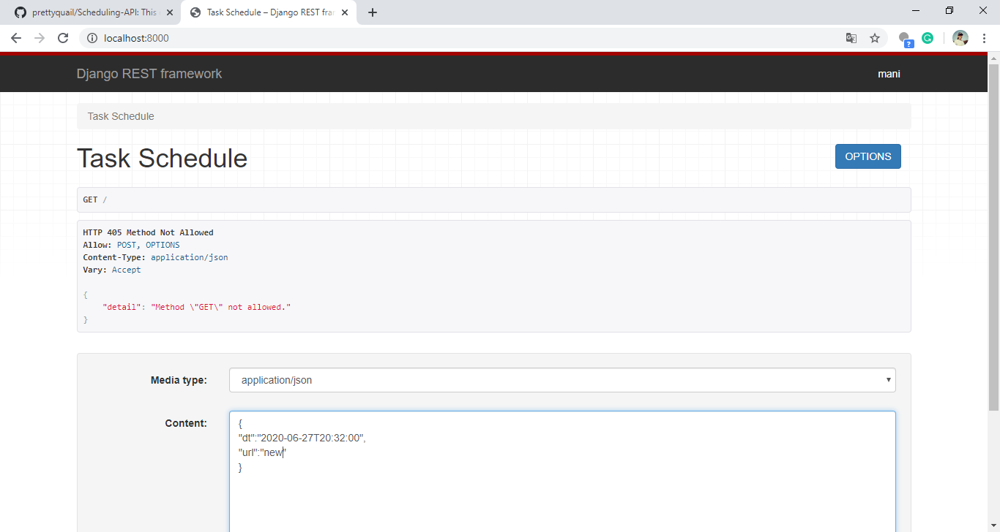
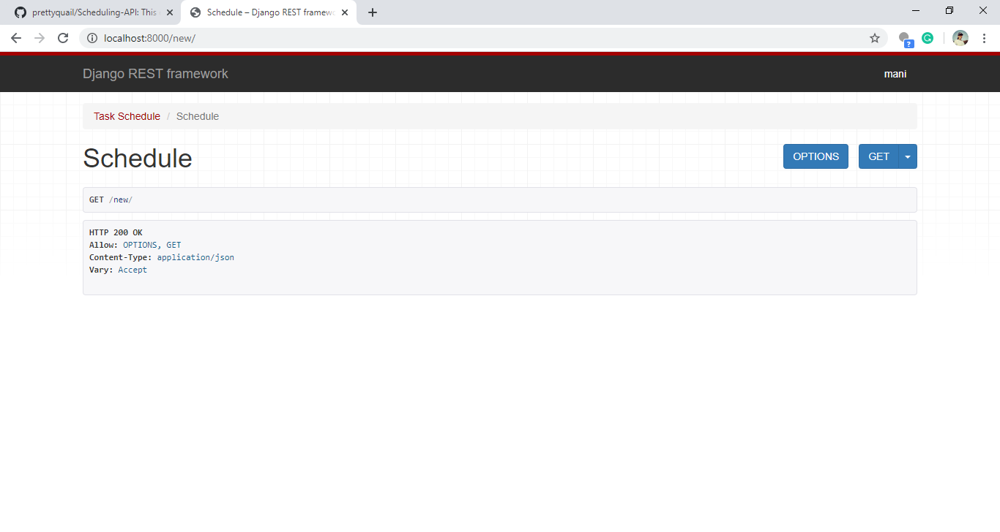
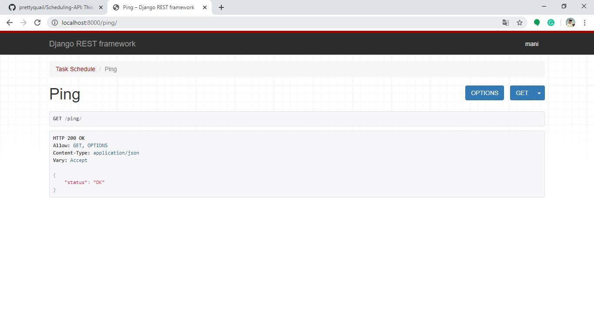

# Scheduling-API
This involves a single endpoint, which accepts Date-Time and a URL as a parameter.

My project consists of the following things-

a]DT model in models.py file having two fields-
-one is url and another one is dt [datetime].
-url is of CharField and dt is of DateTimeField.

b]views.py file consists of three functions that are-

•	TaskSchedule-it is used to create a task by the user, passing two-parameter i.e url and datetime.
       NOTE-datetime must be passed like the following JSON format along with the url-
           {
           "dt":"2020-06-27T20:22:00",
            "url":"new"
            }

•	Schedule-it is used to see whether the current datetime matches with the datetime passed by the user.
       This can be checked by passing url specified by the user at the time of creation.

       For example-
       http://localhost:8000/abcde/
       "Here abcde is the url name"

•	Ping-it is used to check, whether the server is running or not.

c] I made one serializer by name DTSerializer which is used to serialize our data into JSON .

d] urls.py file of ScheduleApi consists of three urls -

•	http://localhost:8000
       by this user can register the new task by passing url and datetime field in the format given above.
       
•	http://localhost:8000/urlname
       in the place of urlname , we need to pass the url which is created by the user.
       
•	http://localhost:8000/ping
       this is used to check server is running or not.

### RESULT-
if the datetime matches with the current datetime {datetime which is passed with the url },then it gives status as 200.

For Example-
Step One
 
Step Two
 
Step Three-
 

API's can also be run in postman by passing data in the raw data form and by choosing JSON as the format.
